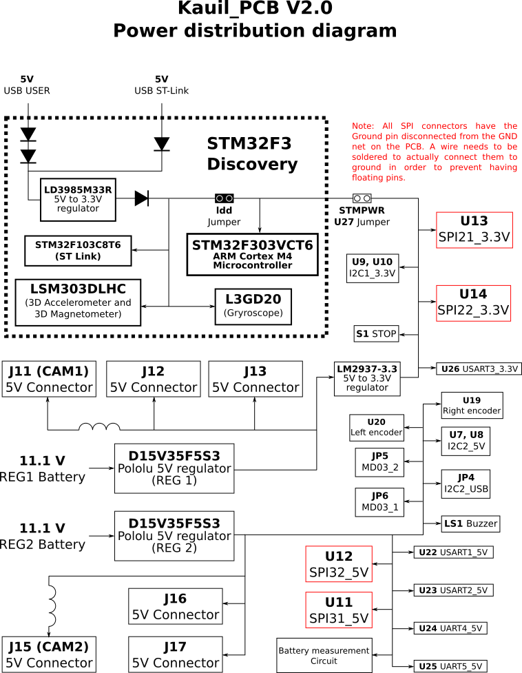

This repository contains the design files for the PCB found on Kauil. The main motivation behind the desigh of this PCB is to have a platform for testing and implementing new hardware easily. Also it should be easy for new students joining the team to start developing for it, this is why we choosed to use the same development board as a core as the one used in the microcontroller (embedded systems) class, the [STM32F3 discovery](http://www.st.com/web/catalog/tools/FM116/SC959/SS1532/PF254044).

The design files were made using [DipTrace](http://diptrace.com/) which can be downloaded freely for 30 days, or without time limitations but with a 300 pin limitation (this design contains more than 300 pins).

## Design of the PCB

The board is for the most part an interface to the various peripherals available on the STM32F3 microcontroller,
but there are also some specific functionalities that should be noted, the is a summary of what the PCB has:

+ Specific purpose connectors, 2 for the MD03 boards and 2 for the encoders. 
+ Driver circuit for a Buzzer to serve as a low battery alert.
+ Driver circuit to read a button so it can be used as an emergency stop. 
+ Analog multiplexer with a voltage divider to measure the voltage of all 5 batteries connected, plus 2 optional
  external signals while using just one ADC.
+ 4 SPI connectors (2 of them 5V tolerant), two connectors per SPI peripheral from the microcontroller with the
  use of CS pins.
+ 4 I2C external connectors, one pair per I2C peripheral on the microcontroller. 2 of them are pulled up to 3.3V
  while the other two are pulled up to 5V.
+ USB communication directly from the microcontroller.
+ One connector for an I2C to USB interface in case communications get saturated over the microcontroler's USB 
  port.
+ 3D gyroscope, 3D magnetometer and 3D accelerometer provided by the STM32F3 discovery board.
+ 5 UART ports (4 of them 5V tolerant)
+ 4 ADC pins exposed to connectors to sense data from various sources.
+ All UART, I2C and SPI connectors have GND and power pins according to the supported voltage to ease the 
  connection of devices with just one connector and one cable.
+ Almost any pin can be set to be a GPIO pin if its specific functionality is not required.

The following diagram shows which pins from the microcontroller are connected to which components on the board,
it's also important to note the red ports that mark issues found while using the board and how they were fixed,
for more information on these see [Known-issues](#known-issues).

  
[PDF version](images/logicalDiagram.pdf)  
[Inkscape's svg version](images/logicalDiagram.svg)

The next diagram shows how the Power sources are distributed within the PCB, care was taken to separate the
regulators that power up the cameras because they are the components that consume the most power (after the CPU
which does not appear in the diagram because it has its own battery and is connected directly).

Note: We've noticed that sometimes when connecting the battery to the regulator in which the Hokuyo is connected 
the regulator shuts down maybe due to a high peak current at startup, most of the times disconnecting and
connecting the battery again fixes this.

  
[PDF version](images/powerDistribution.pdf)  
[Inkscape's svg version](images/powerDistribution.svg)

To modify any of these diagrams clone the repository, edit the svg file locally with
[Inkscape](https://inkscape.org/), update the png and pdf versions and commit the changes.

## Content of the repository

+ **BOM:** This folder contains some spreadsheets with components used for the PCB, costs and suplier links.
+ **Gerbers:** This folder contains the files that were sent to the manufacturer to produce the actual PCB, they were exported from DipTrace.
+ **Lib:** This folder contains library files for DipTrace with all schematic components and PCB patterns used on the PCB, we do not use any external library besides the one provided by DipTrace and the ones found here, so the design is portable.
+ **PCB.dip:** A DipTrace file with the PCB layout and routing.
+ **PCB.jpg: ** A .jpg image of the PCB for quick reference without requiring DipTrace
+ **Schematic.dch:** A DipTrace file with the schematic for the PCB, it contains information about logical connections of the board.
+ **Schematic.jpg:** A .jpg image with the schematics used for the PCB, for easy acces for people that do not have DipTrace.

## Known issues:

V2 of the PCB is the one that was manufactured and is found on Kauil, while doing the code implementation of it we found several problems with the design that had to be corrected for the system to work, the following list explains them, and the fix that was applied, future versions of the board should have them permanently fixed.

* The SDA pin from I2C2 (Used for the MD03 boards) was previously located
  on pin PF0, but this pin is occupied by an 8MHz clock signal that comes
  from the STLink microcontroller on the STM32F3 discovery (U2) and can't
  be changed without slowing down the main microcontroller (the actual
  PF0 pin on the header of the Discovery board is not connected to the 
  microcontroller, and has to be enabled by the SB12 jumper). To fix this 
  the PCB was modified to connect what came into PF0 before to PA10, this 
  pin was the Rx pin for USART1 before, but if required it can be assigned 
  to PC5 which is used for the STLink but suldn't be much trouble while 
  running code (because STLink is just used for programming and debugging), 
  it's important to note that this last jumper wire hasn't been soldered yet.  
  (**Peripherals affected:** I2C2 (MD03), USART1 (Rx pin) )

* The A and B channels for both encoders were assigned incorrectly to pins
  on the STM32F3 that were being already used for interrupts on the two
  sensor chips the LSM303DLHC and the L3GD20, to leave these pins free 
  for future use we chose to move the encoders to other pins, changes made
  were:

      PE4 -> PF9
      PE5 -> PF10
      PE0 -> PB8
      PE1 -> PB9

  (**Periherals affected:** Encoders and external interrupts for sensors 
   LSM303DLHC and the L3GD20)

* The PCB has 4 SPI external connectors, the connector is supposed to 
  provide Ground and Voltage pins to easily connect any device to them,
  but sadly when the schematic was created the Ground pins were left
  unconnected to the actual ground trace. To fix this a wire has to be
  soldered on the bottom of the PCB so the ground is correctly connected.  
  (**Peripherals affected:** all SPI external connectors)

